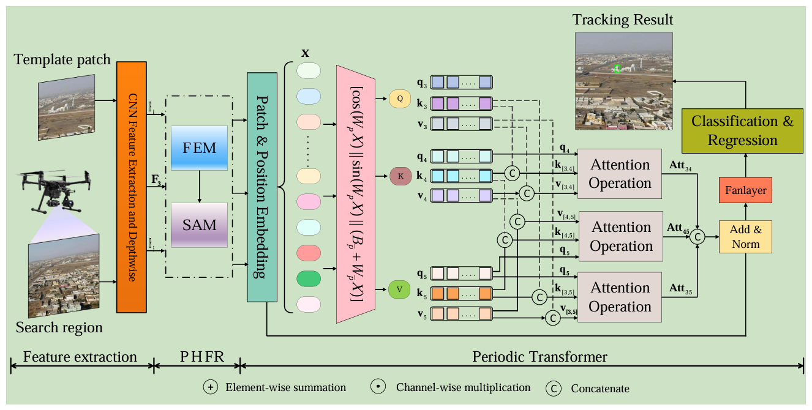
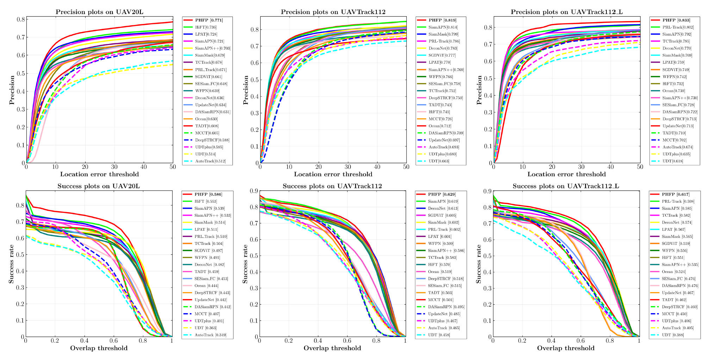
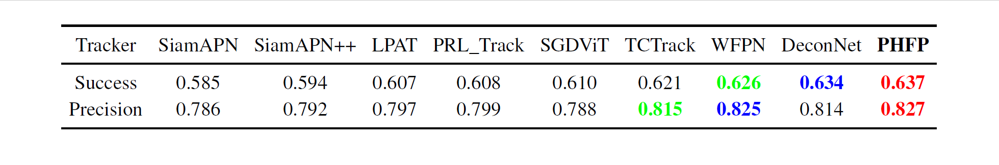
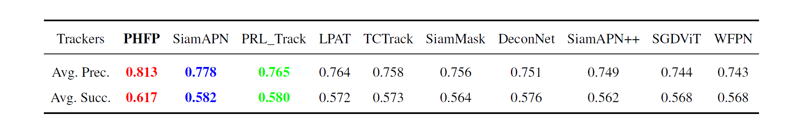

# PHFP
## Abstract
Robust visual tracking for unmanned aerial vehicles (UAVs) remains challenging in dynamic aerial environments because existing methods either fail to capture long-range dependencies in CNN-based models or lose critical lo cal details in Transformer-based approaches, and none explicitly model the in trinsic periodicity of object motion. To overcome these limitations, we propose PHFP, the Progressive Hierarchical Feature Periodic Transformer (PHFP), which is structured as a two-stage representation learning framework for UAV tracking. In the coarse representation learning stage, a Progressive Hierarchical Feature Re f inement (PHFR) module uses a multi-branch atrous Feature Enhancement Mod ule to enrich fine-grained local contexts and a Semantic-Aware Module (SAM) driven by shallow features to suppress background noise and refine deep represen tations. In the fine representation learning stage, a periodic transformer powered by a dedicated Fourier Analysis Network (FAN) hierarchically fuses multi-level feature maps to explicitly extract latent periodic structures and produce robust embeddings. Extensive evaluations on the DTB70, UAV20L, UAVTrack112, and UAVTrack112_L benchmarks demonstrate that PHFP outperforms state-of-the art trackers by significant margins while operating at 32.6 frames per second on an edge-equipped aerial platform, confirming its effectiveness and real-time ca pability. 

<p align="center">
  
</p>

This figure shows the workflow of our tracker.


## Results
### UAV20L, UAVTrack112, UAVTrack112_L
<left></left>
### DTB70
<left></left>
### Average performance comparison
<left></left>

## Presentation Demo
[![[Demo] Progressive Hierarchical Feature Periodic Transformer for Robust UAV Tracking - YouTube](https://i.ytimg.com/vi/9x4YBBV-UwI/maxresdefault.jpg)](https://www.youtube.com/watch?v=9x4YBBV-UwI "[Demo] Progressive Hierarchical Feature Periodic Transformer for Robust UAV Tracking - YouTube")


## Usage
### Installation
Create and activate a conda environment:
```
conda create -n PHFP python=3.8
conda activate PHFP
```
Install the required packages:
```
pip install -r requirements.txt
```

### Data Preparation
* [COCO](http://cocodataset.org)
* [GOT-10K](http://got-10k.aitestunion.com/downloads)
* [LaSOT](http://vision.cs.stonybrook.edu/~lasot/)
 
### Test
Download pretrained model by [Googledrive](https://drive.google.com/file/d/1nzbW0FdwPq13fhfVbqcT6_7q8DhVPgnR/view?usp=drive_link).

The results of TCTrack++ can be [downloaded](https://drive.google.com/drive/folders/1u-nRfeyJBGOwkFBM37PWYPC_DAoxg3ij).

## Qualitative Evaluation
<p align="center">
  
</p>


## Contact
If you have any question, please contact at whjkyx@163.com or quhaoyu7077@163.com.
